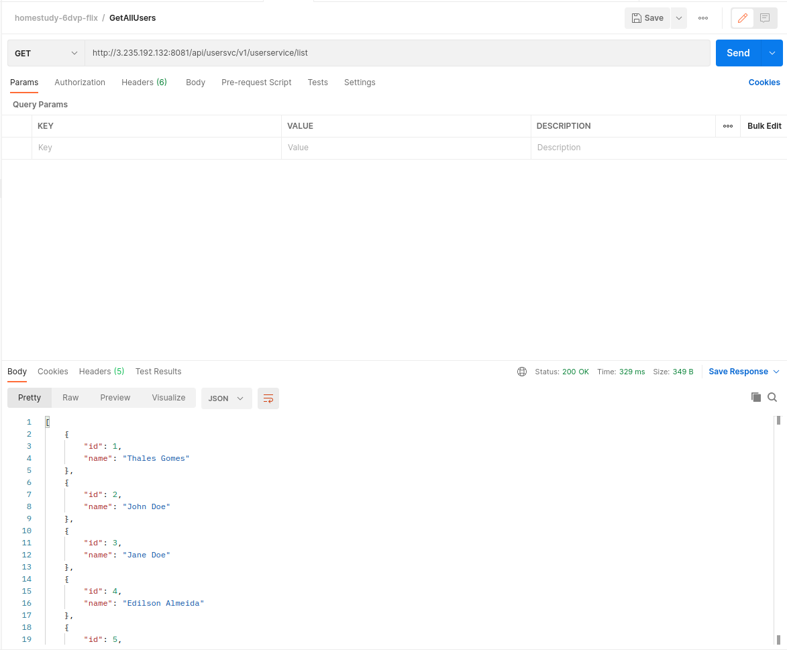
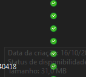

Test Guide / Guia de Testes
==============

To perform testes it will be required to use Postman to send GET/PULL requests to the microservices


Para efetuar os testes será necessário o uso do Postman para envio das chamadas GET/PUT para os microserviços

Replace `<SEU-HOST>` with your host IP, or use localhost in case you're performing local tests

Substitua `<SEU-HOST>` pelo IP do seu host, ou utilize localhost caso esteja fazendo testes locais.

Você pode achar alguns dados de exemplo para usuários e filmes aqui: [Usuários](postman/BatchUsers.json) / [Filmes](postman/BatchMovies.json)

You can find some sample data for users and movies here: [Users](postman/BatchUsers.json) / [Movies](postman/BatchMovies.json)


Endpoints
---------

1. Query API Gateway routes / Consultar rotas do API Gateway

```
http://<SEU-HOST>:8081/actuator/routes
```


2. Batch create users / Criar vários usuários em lote

```
http://<SEU-HOST>:8081/api/usersvc/v1/userservice/create/batch
```


3. Batch Create Movies / Criar vários filmes em lote

```
http://<SEU-HOST>:8081/api/moviesvc/v1/movieservice/create/batch
```


4. List all users / Listar todos os usuários

```
http://<SEU-HOST>:8081/api/usersvc/v1/userservice/list
```



5. List all movies / Listar todos os filmes

```
http://<SEU-HOST>:8081/api/moviesvc/v1/movieservice/list
```


6. Query movies from a specific genre (_Note: replace `{move-genre-string}` with the genre in text format_) / Consultar filmes de um determinado gênero (_Nota: substituir `{move-genre-string}` pelo gênero em formato texto_)

```
http://<SEU-HOST>:8081/api/moviesvc/v1/movieservice/genre/{movie-genre-string}
```


7. Query movie details (_Note: replace `{movie-id}` with the  actual movie ID_) / Consultar detalhes de um filme (_Nota: substituir `{movie-id}` pelo ID do filme_)


```
http://<SEU-HOST>:8081/api/moviesvc/v1/movieservice/{movie-id}
```


8. Like a movie / Votar em filmes que mais gostei

**Toggling Like Option / Chaveamento da Opção Gostar**

```
http://<SEU-HOST>:8081/api/usersvc/v1/usermoviesservice/togglelike
```


9. Tag a movie to be watched later / Marcar um filme ou série para ser visto no futuro

```
http://<SEU-HOST>:8081/api/usersvc/v1/usermoviesservice/togglewatchlater
```



10. Query a movie by keyword / Buscar um filme por palavra-chave

```
http://<SEU-HOST>:8081/api/moviesvc/v1/movieservice/keyword
```


11. Display most viewed movies by genre / Exibir os filmes mais vistos por categorias

```
http://<SEU-HOST>:8081/api/moviesvc/v1/movieservice/mostviews
```


12. Create a service request for an ongoing problem / Abrir um chamado técnico de algum problema que está acontecendo

```
http://<SEU-HOST>:8081/api/usersvc/v1/userservice/request/create
```


13. Query movies and series that have already been watched / Visualizar os filmes e séries que já foram assistidos

**Setting an user movie as watched / Definindo um filme do usuário como já assistido**


```
http://<SEU-HOST>:8081/api/usersvc/v1/usermoviesservice/setwatched
```


**Displaying already watched movies** (_Note: replace `{user-id}` with the  actual user ID_) / **Visualização dos filmes já assistidos** (_Nota: substituir `{user-id}` pelo ID do usuário_)


```
http://<SEU-HOST>:8081/api/usersvc/v1/profilerservice/watched/{user-id}
```


