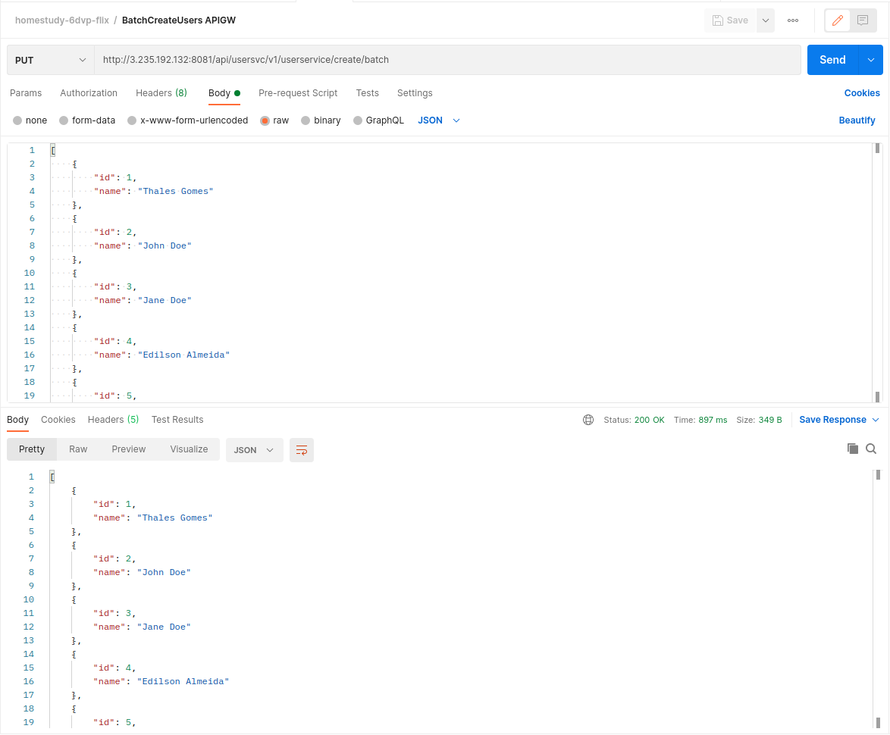

Guia de testes
==============

Para efetuar os testes será necessário o uso do Postman para envio das chamadas GET/PUT para os microserviços

Substitua `<SEU-HOST>` pelo IP do seu host, ou utilize localhost caso esteja fazendo testes locais.

Endpoints
---------

1. Consultar rotas do API Gateway

```
http://<SEU-HOST>:8081/actuator/routes
```


2. Criar vários usuários em lote

```
http://<SEU-HOST>:8081/api/usersvc/v1/userservice/create/batch
```



3. Criar vários filmes em lote

```
http://<SEU-HOST>:8081/api/moviesvc/v1/movieservice/create/batch
```


4. Listar todos os usuários

```
http://<SEU-HOST>:8081/api/usersvc/v1/userservice/list
```


5. Listar todos os filmes

```
http://<SEU-HOST>:8081/api/moviesvc/v1/movieservice/list
```


6. Consultar filmes de um determinado gênero

```
http://<SEU-HOST>:8081/api/moviesvc/v1/movieservice/genre/fiction
```


7. Consultar detalhes de um filme (_Nota: substituir `{movie-id}` pelo ID do filme_)


```
http://<SEU-HOST>:8081/api/moviesvc/v1/movieservice/{movie-id}
```


8. Votar em filmes que mais gostei

**Chaveamento da Opção Gostar**

```
http://<SEU-HOST>:8081/api/usersvc/v1/usermoviesservice/togglelike
```


**Gostar**

```
http://<SEU-HOST>:8081/api/moviesvc/v1/movieservice/upvote
```


**Remover Gostar**


```
http://<SEU-HOST>:8081/api/moviesvc/v1/movieservice/downvote
```


9. Marcar um filme ou série para ser visto no futuro

```
http://<SEU-HOST>:8081/api/usersvc/v1/usermoviesservice/togglewatchlater
```


10. Buscar um filme por palavra-chave

```
http://<SEU-HOST>:8081/api/moviesvc/v1/movieservice/keyword
```


11. Exibir os filmes mais vistos por categorias

```
http://<SEU-HOST>:8081/api/moviesvc/v1/movieservice/mostviews
```


12. Abrir um chamado técnico de algum problema que está acontecendo

```
http://<SEU-HOST>:8081/api/usersvc/v1/userservice/request/create
```


13. Visualizar os filmes e séries que já foram assistidos

**Definindo um filme do usuário como já assistido**


```
http://<SEU-HOST>:8081/api/usersvc/v1/usermoviesservice/setwatched
```


**Visualização dos filmes já assistidos** (_Nota: substituir `{user-id}` pelo ID do usuário_)


```
http://<SEU-HOST>:8081/api/usersvc/v1/profilerservice/watched/{user-id}
```


